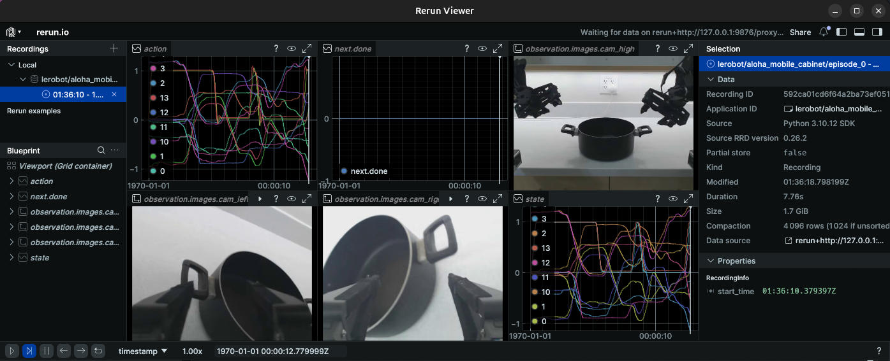
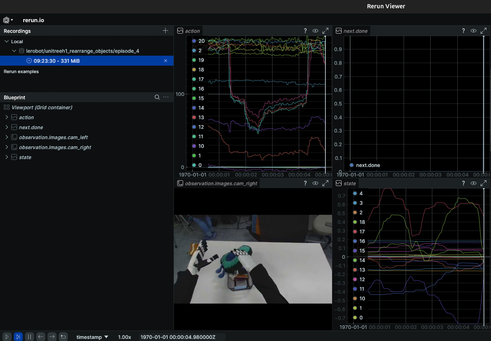

# LeRobot Experience

Hugging Face LeRobot 学习与实践项目。LeRobot 是一个基于 PyTorch 的开源机器人库，旨在降低机器人技术的门槛，提供预训练模型、数据集和工具。

**从低成本机械臂到人形机器人，从模拟环境到真实世界 —— 让机器人学习变得简单！** 🤖🤗

---

## ✨ 核心特性

- 🔧 **硬件无关接口**: 统一的 `Robot` 类，支持从低成本机械臂到人形机器人的多种硬件
- 📊 **LeRobotDataset**: 标准化的数据集格式（Parquet + MP4），支持高效存储和流式传输
- 🧠 **SOTA 策略**: 包含 ACT, Diffusion Policy, VLA 等最新算法的 PyTorch 实现
- 🎁 **预训练模型**: 提供开箱即用的预训练模型，可直接从 Hugging Face Hub 下载
- 📈 **可视化工具**: 用于数据集检查和策略评估的 Rerun 可视化
- 🌐 **多环境支持**: PushT, Aloha, LIBERO, xArm, Unitree H1 等主流仿真与真实机器人

---

## 🤖 支持的机器人与任务

### Aloha Mobile - 真实世界操作

<div align="center">
  
  <p><i>数据集可视化：Aloha 移动双臂机器人 - 开柜子任务 (lerobot/aloha_mobile_cabinet)</i></p>
</div>

Aloha 是一个低成本的双臂遥操作机器人系统，支持复杂的双手协作任务。LeRobot 提供了完整的 Aloha 真实世界数据集和预训练模型。

### Unitree H1 - 人形机器人操作

<div align="center">
  
  <p><i>数据集可视化：Unitree H1 人形机器人 - 物体整理任务 (lerobot/unitreeh1_rearrange_objects)</i></p>
</div>

支持人形机器人的复杂操作任务，包括物体整理、折叠衣物等精细操作。

### 更多支持的环境

| 环境 | 类型 | 任务示例 | 数据集 |
|:---|:---|:---|:---|
| **PushT** | 2D 模拟 | 推动 T 形块到目标位置 | ✅ 206 episodes |
| **Aloha** | 3D 模拟 + 真实 | 双臂协作、物体传递 | ✅ 85+ episodes |
| **LIBERO** | 3D 模拟 | 130 个操作任务（5 个品类） | ✅ 1693 episodes |
| **xArm** | 真实机械臂 | 拾取、放置 | ✅ 800 episodes |
| **Unitree H1** | 人形机器人 | 整理、折叠 | ✅ 30-38 episodes |

---

## 🎯 快速演示 - 零代码体验

无需编写任何代码，直接运行预训练模型看效果！

### 运行 ACT 控制 Aloha 双臂机器人

**ACT (Action Chunking with Transformers)** 是专为双臂协作任务设计的模仿学习算法：

```bash
conda activate lerobot

python lerobot/src/lerobot/scripts/lerobot_eval.py \
    --policy.path=lerobot/act_aloha_sim_transfer_cube_human \
    --env.type=aloha \
    --env.task=AlohaTransferCube-v0 \
    --eval.batch_size=1 \
    --eval.n_episodes=10 \
    --policy.device=cuda
```

**评估结果示例 - ACT on Aloha**：

<div align="center">
  <video src="doc/assets/eval_episode_3.mp4" width="600" controls>
    您的浏览器不支持视频播放。
  </video>
  <p><i>ACT 策略在 Aloha 环境中的评估 - 方块传递任务</i></p>
</div>

### 运行 VLA 模型（视觉语言动作）

**SmolVLA** - 轻量级 VLA 模型（450M 参数，消费级 GPU 友好）：

```bash
export MUJOCO_GL=egl

python lerobot/src/lerobot/scripts/lerobot_eval.py \
    --policy.path=HuggingFaceVLA/smolvla_libero \
    --env.type=libero \
    --env.task=libero_10 \
    --eval.batch_size=2 \
    --eval.n_episodes=5 \
    --policy.device=cuda
```

**评估结果示例 - SmolVLA on LIBERO**：

<div align="center">
  <video src="doc/assets/eval_episode_2.mp4" width="600" controls>
    您的浏览器不支持视频播放。
  </video>
  <p><i>SmolVLA 策略在 LIBERO-Long (libero_10) 任务上的评估</i></p>
</div>

**Pi0** - 强大的通用 VLA 模型（1.4B 参数）：

```bash
python lerobot/src/lerobot/scripts/lerobot_eval.py \
    --policy.path=lerobot/pi0_libero_finetuned \
    --env.type=libero \
    --env.task=libero_10 \
    --eval.batch_size=1 \
    --eval.n_episodes=10 \
    --policy.device=cuda
```

### 📹 评估结果保存位置

运行完成后，所有评估视频和指标数据会保存在：

```
outputs/eval/{日期}/{时间}_{任务名}/
├── videos/               # 每个 episode 的 MP4 录像
│   ├── {suite}_{task_id}_{episode_0}.mp4
│   ├── {suite}_{task_id}_{episode_1}.mp4
│   └── ...
└── eval_info.json       # 成功率和奖励统计
```

**示例**：
- ACT on Aloha: `outputs/eval/2025-12-25/09-47-14_aloha_act/videos/aloha_0_episode_3.mp4`
- SmolVLA on LIBERO: `outputs/eval/2025-12-25/22-48-14_libero_smolvla/videos/libero_10_9_episode_2.mp4`

👉 **更多演示和详细说明**: [查看数据集可视化指南 (visualize_datasets.md)](./visualize_datasets.md) | [运行预训练策略指南 (run_pretrained_policy.md)](./run_pretrained_policy.md)

---

## 📦 安装与配置

### 项目结构

```
lerobot-experience/
├── lerobot/                   # LeRobot 源码（submodule）
│   ├── src/lerobot/           # 核心源码
│   ├── examples/              # 示例代码
│   └── docs/                  # 文档
├── visualize_datasets.md      # 数据集可视化与使用指南
├── run_pretrained_policy.md   # 运行策略指南
└── README.md                  # 本文档
```

---

## 系统要求

- **操作系统**: Linux (Ubuntu 22.04+), macOS, Windows (WSL2)
- **Python**: 3.10+
- **PyTorch**: 2.4+
- **其他**: FFmpeg (用于视频处理)

---

## 🚀 快速开始

### 1. 克隆项目

```bash
git clone <your-repo-url> lerobot-experience
cd lerobot-experience
```

### 2. 初始化 Submodule

```bash
git submodule update --init --recursive
```

### 3. 创建虚拟环境（推荐）

```bash
# 创建 Python 3.10 环境
conda create -n lerobot python=3.10 -y
conda activate lerobot
```

### 4. 安装 LeRobot

**方式一：使用 init.sh 自动安装（推荐）**

```bash
# 在项目根目录运行（会自动检测并安装缺失的依赖）
./init.sh
```

`init.sh` 会自动：
- ✅ 激活 lerobot conda 环境（如果未激活）
- ✅ 安装 LeRobot 核心包（editable 模式）
- ✅ 检测并安装缺失的环境依赖（libero, aloha, pusht 等）
- ✅ 处理 libero 的特殊依赖（hf-egl-probe 预编译包）
- ✅ **自动安装 Pi0/Pi0.5 所需的 transformers 版本** (fix/lerobot_openpi)

**方式二：手动 pip 安装**

```bash
pip install lerobot
```

**方式三：源码安装（开发者）**

```bash
cd lerobot
pip install -e ".[test, aloha, pusht, xarm, umi]"
cd ..
```

> **注意**：
> - `[test, aloha, pusht, xarm, umi]` 包含额外依赖项，用于支持特定机器人环境
> - `libero` 环境需要额外的系统依赖（EGL 库），`init.sh` 会自动处理

### 5. 验证安装

```bash
lerobot-info
```

---

## 📊 预训练模型与数据集

### VLA 模型对比

| 模型 | 参数量 | 显存需求 | 适用场景 | 特点 |
|:---|:---|:---|:---|:---|
| **SmolVLA** | 450M | 4-8GB | LIBERO, Meta-World | 高效、快速、适合消费级 GPU |
| **Pi0** | 1.4B | 24GB+ | 通用机器人控制 | 强大的视觉语言理解 |
| **Pi0.5** | ~1.4B | 24GB+ | 多任务微调 | Pi0 改进版 |
| **ACT** | - | 8-16GB | Aloha 双臂操作 | 经典模仿学习算法 |
| **Diffusion Policy** | - | 8-16GB | PushT 等推动任务 | 扩散模型 + 行为克隆 |

### 常用数据集

| 任务类型 | 数据集 ID | 预训练模型 | Episodes |
|:---|:---|:---|:---|
| **PushT** | `lerobot/pusht` | `lerobot/diffusion_pusht` | 206 |
| **Aloha Sim** | `lerobot/aloha_sim_transfer_cube_human` | `lerobot/act_aloha_sim_transfer_cube_human` | - |
| **Aloha Real** | `lerobot/aloha_mobile_cabinet` | - | 85 |
| **LIBERO** | `lerobot/libero` | `lerobot/pi0_libero_finetuned` | 1693 |
| **xArm** | `lerobot/xarm_lift_medium` | - | 800 |
| **Unitree H1** | `lerobot/unitreeh1_rearrange_objects` | - | 30-38 |

---

## 📚 学习资源

### 本项目文档

- 📖 **[数据集可视化指南 (visualize_datasets.md)](./visualize_datasets.md)** - 详细的数据集可视化教程
- 📖 **[运行预训练策略 (run_pretrained_policy.md)](./run_pretrained_policy.md)** - 详细的预训练策略运行与评估教程

### 官方文档

- 🏠 [GitHub 仓库](https://github.com/huggingface/lerobot)
- 📖 [官方文档](https://huggingface.co/docs/lerobot)
- 🛠️ [安装指南](https://huggingface.co/docs/lerobot/installation)
- 💾 [数据集 Hub](https://huggingface.co/lerobot)
- 📝 [SmolVLA 博客](https://huggingface.co/blog/smolvla)
- 🤖 [Pi0 介绍](https://huggingface.co/blog/pi0)

### LIBERO 基准测试

LIBERO 是终身机器人学习基准，包含 **5 个品类**，共 **130 个任务**：

| 品类 | 标识符 | 任务数 | 用途 |
|:---|:---|:---|:---|
| **LIBERO-Spatial** | `libero_spatial` | 10 | 空间关系推理 |
| **LIBERO-Object** | `libero_object` | 10 | 物体操作 |
| **LIBERO-Goal** | `libero_goal` | 10 | 目标条件任务 |
| **LIBERO-90** | `libero_90` | 90 | 短序列任务 |
| **LIBERO-Long** | `libero_10` | 10 | 长序列任务 |

**评估多个品类示例**：

```bash
python lerobot/src/lerobot/scripts/lerobot_eval.py \
    --policy.path=lerobot/pi0_libero_finetuned \
    --env.type=libero \
    --env.task=libero_spatial,libero_object,libero_goal,libero_10 \
    --eval.batch_size=1 \
    --eval.n_episodes=10
```

---

## 💡 使用技巧

### 无头服务器渲染（重要）

在 SSH 远程服务器运行 LIBERO/robosuite 环境时，需要设置：

```bash
# GPU 加速渲染（推荐）
export MUJOCO_GL=egl
export PYOPENGL_PLATFORM=egl
export EGL_DEVICE_ID=0

# 或使用 CPU 软件渲染（更稳定但慢）
export MUJOCO_GL=osmesa
```

### 可视化数据集

使用 Rerun 交互式查看数据集：

```bash
python lerobot/src/lerobot/scripts/lerobot_dataset_viz.py \
    --repo-id lerobot/pusht \
    --episode-index 0
```

会自动在浏览器打开 `http://127.0.0.1:9090`。

### 显存优化

- 减小 `eval.batch_size`（例如设为 1）
- 对于大模型（Pi0），确保使用高端 GPU (A100/H100)
- 使用 `--policy.device=cpu` 作为调试选项（速度极慢）

---

## ❓ 常见问题

### FFmpeg 未安装

如果遇到视频处理相关的错误，请确保安装了 FFmpeg：

```bash
sudo apt-get install ffmpeg
```

### MuJoCo 错误

某些环境（如 Aloha）依赖 MuJoCo。pip 通常会自动安装，但如果遇到问题，请参考 [MuJoCo 安装文档](https://github.com/google-deepmind/mujoco)。

### EGL 渲染错误（EGL_NOT_INITIALIZED）

在无头服务器上运行 LIBERO/robosuite 时的常见问题：

```bash
# 设置环境变量
export MUJOCO_GL=egl
export PYOPENGL_PLATFORM=egl
export EGL_DEVICE_ID=0

# 如果 EGL 仍然出错，尝试 OSMesa
export MUJOCO_GL=osmesa
```

### Pi0/Pi0.5 transformers 版本错误

如果遇到 `ValueError: An incorrect transformer version is used` 错误：

```bash
# 重新运行初始化脚本，会自动安装正确的 transformers 版本
./init.sh
```

### 找不到 policy_preprocessor.json

这是旧版模型的问题。脚本会自动从模型权重中提取统计信息。如果仍然报错，请检查网络连接。

---

## 🌟 贡献与反馈

欢迎提交 Issue 和 Pull Request！

- 💬 问题反馈：[GitHub Issues](https://github.com/huggingface/lerobot/issues)
- 🤝 贡献指南：[Contributing Guide](https://github.com/huggingface/lerobot/blob/main/CONTRIBUTING.md)

---

**Happy Robot Learning! 🤖🤗**
